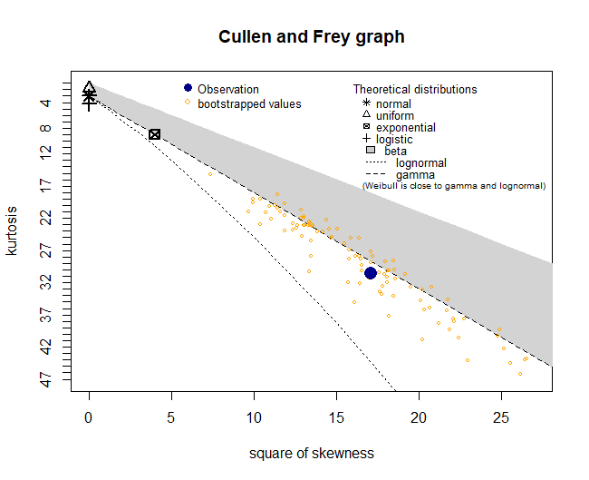

```{r, include = FALSE}
knitr::opts_chunk$set(
  collapse = TRUE,
  fig.height=5,
  fig.width=7,
  comment = "#>"
)
```

```{r setup}
library(DATA501.GI0.HE)
```

# Introduction

The `GI0.trialHE` package makes available the four common functions of the $G_I^0$ distribution introduced in @hetero-clutter. This vignette is aimed at demonstrating the basic uses of these functions, as well as a graphical comparison of a $G_I^0$ model to other common distributions using a Cullen-Frey plot.

The GI0 distribution is defined by the following density function [@sampling-from-GI0]:

$$
\begin{aligned}
f_Z (z) = \frac{L^L \Gamma(L - \alpha)}{\gamma^\alpha \Gamma(-\alpha) \Gamma(L)} \cdot \frac{z^{L - 1}}{(\gamma + zL)^{L - \alpha}}
\end{aligned}
$$

where $-\alpha, \gamma, z > 0$ and $L \geq 1$. $-\alpha$ represents roughness, $\gamma$ represents scale, and $L$ represents 'looks'.

# Functions

In line with other distribution functions available in R, the four functions available in this package are for density `dGI0`, cumulative distribution function `pGI0`, quantile function `qGI0`, and random value generator `rGI0`.

## `dGI0`

To generate the probability density of point `x` of a $G_I^0$ distribution with parameters `p_alpha`, `p_gamma` and `p_Looks`. Figure \@ref(fig:example-dGI0) plots the probability density functions of three different $G_I^0$ distributions calculated using `dGI0()`.

```{r example-dGI0, fig.align='center', fig.cap="P.d.f. of various GI0 distributions",}
x_range1 <- seq(0.1, 30, 0.001)

d1 <- dGI0(x_range1, -0.5, 1, 1)
d2 <- dGI0(x_range1, -2, 4, 5)
d3 <- dGI0(x_range1, -1, 6, 6)

plot(x_range1, d1, type='l', col='navy', 
     xlab='X', ylab='Density')
lines(x_range1, d2, col='chartreuse4')
lines(x_range1, d3, col='darkred')
legend(15.5, 0.875, col=c("navy", "chartreuse4", "darkred"), lty=1,
       legend=c("alpha=-0.5, gamma=1, L=1", "alpha=-2, gamma=4, L=5", "alpha=-1, gamma=6, L=6"))
```

## `pGI0`

To generate the cumulative probability $P(X \leq x)$ of point `x` of a $G_I^0$ distribution with parameters `p_alpha`, `p_gamma` and `p_Looks`. Figure \@ref(fig:example-pGI0) plots the cumulative distribution function of three different $G_I^0$ distributions calculated using `pGI0()`.

```{r example-pGI0, fig.align='center', fig.cap="C.d.f. of various GI0 distributions",}
p1 <- pGI0(x_range1, -0.5, 1, 1)
p2 <- pGI0(x_range1, -2, 4, 5)
p3 <- pGI0(x_range1, -1, 6, 6)

plot(x_range1, p1, type='l', col='navy', ylim=c(0, 1),
     xlab='X', ylab='Cumulative probability')
lines(x_range1, p2, col='chartreuse4')
lines(x_range1, p3, col='darkred')
legend(15.5, 0.3, col=c("navy", "chartreuse4", "darkred"), lty=1,
       legend=c("alpha=-0.5, gamma=1, L=1", "alpha=-2, gamma=4, L=5", "alpha=-1, gamma=6, L=6"))
```

## `qGI0`

To generate the quantile value $X \leq Q(p)$ of point `p` of a $G_I^0$ distribution with parameters `p_alpha`, `p_gamma` and `p_Looks`. Figure \@ref(fig:example-qGI0) plots the quantile functions of three different $G_I^0$ distributions calculated using `qGI0()`.

```{r example-qGI0, fig.align='center', fig.cap="Quantile functions of various GI0 distributions",}
x_range2 <- seq(0, 1, 0.001)

q1 <- qGI0(x_range2, -0.5, 1, 1)
q2 <- qGI0(x_range2, -2, 4, 5)
q3 <- qGI0(x_range2, -1, 6, 6)

plot(x_range2, q1, type='l', col='navy', ylim=c(0, 30),
     xlab='p', ylab='X')
lines(x_range2, q2, col='chartreuse4')
lines(x_range2, q3, col='darkred')
legend(0, 30, col=c("navy", "chartreuse4", "darkred"), lty=1,
       legend=c("alpha=-0.5, gamma=1, L=1", "alpha=-2, gamma=4, L=5", "alpha=-1, gamma=6, L=6"))
```

## `rGI0`

To generate `n` random deviates from a GI0 distribution with parameters `p_alpha`, `p_gamma` and `p_Looks`. Figure \@ref(fig:example-rGI0) plots the histogram of 1,000 values generated from a $G_I^0(-5, 3, 4)$ with the addition of the theoretical density of the distribution on top.

```{r example-rGI0, fig.align='center', fig.cap="Histogram of generated $G_I^0 (-5, 3, 4)$ values (beige), and it's theoretical density (blue line)."}
set.seed(1888, kind="Mersenne-Twister")
GI0_rand <- rGI0(1000, -5, 3, 4, from.F=FALSE)
hist(GI0_rand, freq=FALSE, breaks=nclass.FD(GI0_rand), col="beige", xlab="GI0")

x_range3 <- seq(0, max(GI0_rand), 0.001)
GI0_dens <- dGI0(x_range3, -5, 3, 4)
lines(x_range3, GI0_dens, col="blue4")
```

As the histogram shows, there are quite a few outliers present in the randomly generated samples, demonstrating one of the characteristics of $G_I^0$ distributions of being able to model frequent extreme values.

# Comparison with other distributions

To compare what $G_I^0$ distributions are like in contrast with other common distributions, a Cullen-Frey plot can be used [@cullen-frey]. By plotting the (square of) skewness and kurtosis, a random sample's distributional shape can be placed and compared relative to other distributions.


In \@ref(fig:cfp-rGI0) below, the 1,000 samples from the $G_I^0(-5, 3, 4)$ distribution generated from the previous section has been placed as a point in a Cullen-Frey plot using the `fitdistrplus` library [@fitdistrplus]. Then to estimate the point's variability, 100 bootstrap samples have been taken from the original sample and also placed on the plot.

```{r, eval=FALSE}
library(fitdistrplus)
set.seed(1967)
descdist(GI0_rand, boot=100)
```

```{r cfp-rGI0, fig.align='center', fig.cap="Cullen-Frey plot of the original $G_I^0(-5, 3, 4)$ sample (blue) and it's 100 bootstrapped samples (yellow).", echo=FALSE}

```

The original sample's shape lies somewhere in between the log-normal and the gamma, but clearly the spread of the bootstrapped samples indicate huge variability - even some overlap with the beta. This demonstrates the high flexibility of a $G_I^0$ distribution.

# References
